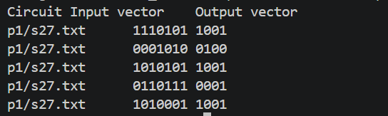
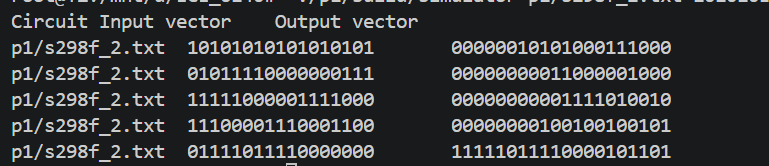
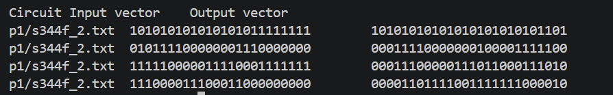
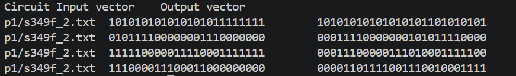

# Boolean Circuit Simulation — Technical Report

## Data structures

The simulator represents a combinational Boolean circuit using a `Circuit` object. Its `inputs` and `outputs` are `std::vector<int>` containers holding node IDs in declaration order. This order determines the correspondence between vector bit positions and nodes. The `-1` declaration terminator is excluded. Vectors preserve order and accommodate different circuit sizes.

Each `Gate` stores a string `kind`, a vector of source node IDs, and an integer destination node ID. `INV` and `BUF` have one source; `AND`, `OR`, `NAND`, and `NOR` have two. A `std::vector<Gate>` stores gates in file order. Gate indices identify entries in this vector and are distinct from wire/node IDs. Connectivity is parsed from the file; no circuit-specific logic is embedded in the simulator.

Each simulation creates a fresh `std::unordered_map<int, int>` named `values`, mapping node IDs to bits (0 or 1). A map supports node IDs that are not consecutive. Initially, only primary inputs have values. Evaluating a gate adds its destination value. Fresh state prevents earlier input vectors from affecting later runs.

Scheduling uses three containers. A `std::vector<std::size_t>` named `missing` counts each gate's unavailable, distinct source nodes. An `std::unordered_map<int, std::vector<std::size_t>>` named `consumers` maps each unavailable source to the gate indices waiting for it. A `std::queue<std::size_t>` named `ready` holds gates with no unresolved sources. A temporary `std::unordered_set<int>` removes duplicate source IDs when constructing dependencies, so a gate using the same wire twice waits for that wire only once.

Input and output vectors use strings to preserve leading zeros. The batch runner associates each circuit name with five input strings and exports computed results as Markdown and CSV. Assuming average constant-time hash operations, a simulation takes O(I + G + E + O) time and space, where I and O are input and output counts, G is the gate count, and E is the number of distinct gate-source dependencies.

## Simulation algorithm

The parser assumes valid supplied circuit syntax. It reads lines, stores INPUT/OUTPUT IDs up to `-1`, and records each gate's operation, sources, and destination. The batch runner loads each circuit once and applies the following algorithm to each of its five vectors:

```text
SIMULATE(circuit, input_vector)
    Reject incorrect vector length or nonbinary characters
    Create empty node-value map values
    For each input position i:
        values[inputs[i]] = integer bit input_vector[i]

    Create empty queue ready and empty map consumers
    Initialize missing[i] = 0 for every gate i
    For each gate i:
        For each distinct source node s of gate i:
            If s has no value:
                Increment missing[i]
                Append i to consumers[s]
        If missing[i] = 0: enqueue i

    executed = 0
    While ready is not empty:
        Remove gate index i from the front
        Read gate i's source bits from values
        Evaluate its Boolean operation
        Store the bit at values[gate i's destination]
        Increment executed
        For each consumer j waiting for that destination:
            Decrement missing[j]
            If missing[j] = 0: enqueue j

    If executed differs from the gate count:
        Report a cycle or missing source
    Collect bits in OUTPUT declaration order
    Return the resulting binary string
```

A gate enters the queue only when all its source values are available. For the supplied circuits with unique drivers, each gate executes once and releases its waiting consumers. File order therefore need not match evaluation order. The six operations INV, BUF, AND, OR, NAND, and NOR evaluate as `!a`, `a`, `a && b`, `a || b`, `!(a && b)`, and `!(a || b)`, respectively. Simulation is combinational, without clock, stored-state, or propagation-delay modeling.

## Simulation data

Tables identify the benchmark circuits by their `.chat` names; local descriptions use corresponding `.txt` filenames. All results were generated by the C++ simulator. Bits follow INPUT and OUTPUT declaration order, not sorted node IDs.

### s27.chat

| Input vector | Output vector |
|---|---|
| `1110101` | `1001` |
| `0001010` | `0100` |
| `1010101` | `1001` |
| `0110111` | `0001` |
| `1010001` | `1001` |



### s298f_2.chat

| Input vector | Output vector |
|---|---|
| `10101010101010101` | `00000010101000111000` |
| `01011110000000111` | `00000000011000001000` |
| `11111000001111000` | `00000000001111010010` |
| `11100001110001100` | `00000000100100100101` |
| `01111011110000000` | `11111011110000101101` |



### s344f_2.chat

| Input vector | Output vector |
|---|---|
| `101010101010101011111111` | `10101010101010101010101101` |
| `010111100000001110000000` | `00011110000000100001111100` |
| `111110000011110001111111` | `00011100000111011000111010` |
| `111000011100011000000000` | `00001101111001111111000010` |
| `011110111100000001111111` | `10011101111000001001000100` |



### s349f_2.chat

| Input vector | Output vector |
|---|---|
| `101010101010101011111111` | `10101010101010101101010101` |
| `010111100000001110000000` | `00011110000000101011110000` |
| `111110000011110001111111` | `00011100000111010001111100` |
| `111000011100011000000000` | `00001101111001110010001111` |
| `011110111100000001111111` | `10011101111000001010000100` |


